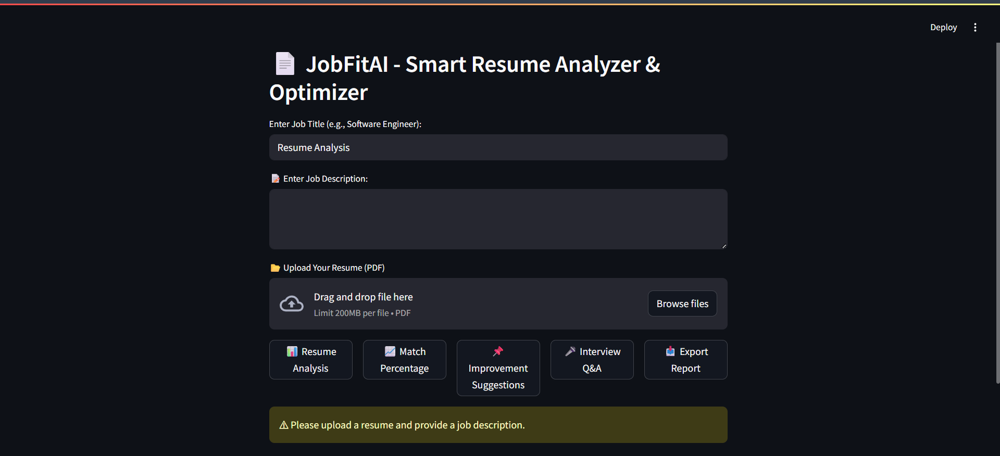
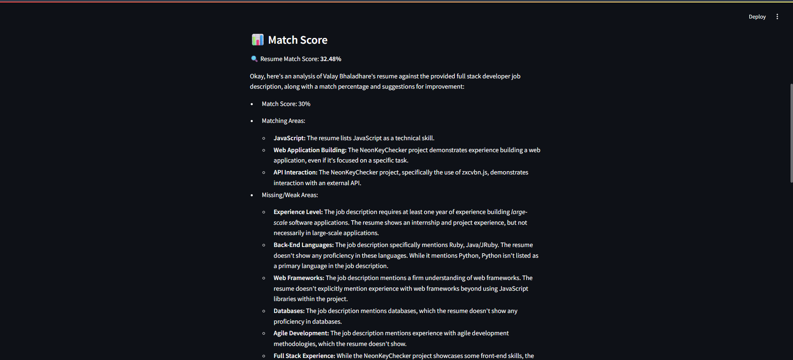
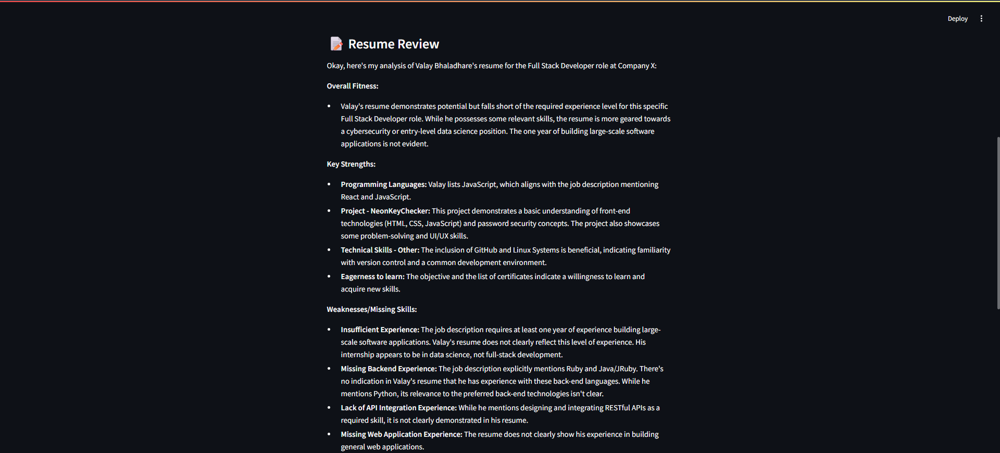
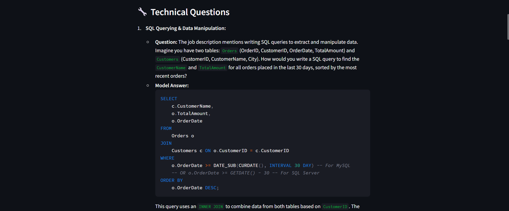

# JobFitAI 🎯

An AI-powered resume analyzer that helps match your resume with job descriptions.


## ✨ Features

- 📊 Smart Resume Analysis
- 🎯 Job Description Matching
- 💡 Improvement Suggestions
- 🎤 Interview Q&A Generator
- 📑 Downloadable PDF Reports

## 🖼️ Screenshots

<div align="center">
  
  
</div>

<div align="center">
  
  
</div>

## 🚀 Quick Start

1. Clone the repo

```bash
git clone https://github.com/Valay-2004/JobFitAI.git
```

2. Install requirements

```bash
pip install -r requirements.txt
```

3. Add your API key

```bash
# Create .env file and add your Google API key
GOOGLE_API_KEY=your_api_key_here
```

4. Run the app

```bash
streamlit run app.py
```

## 🛠️ Tech Stack

- Streamlit
- Google Gemini AI
- PyMuPDF
- Scikit-learn
- NLTK
- Plotly

## 📝 How to Use

1. Enter job title
2. Paste job description
3. Upload your resume (PDF)
4. Click any action button:
   - Analyze Resume
   - Get Match Score
   - Get Suggestions
   - Get Interview Q&A
   - Download Report

<!-- ## 📊 Output Example

 -->

## 🔐 Privacy Note

- All data is processed locally
- No resumes are stored
- Secure API handling

---

Made with ❤️ using Streamlit and Google Gemini
